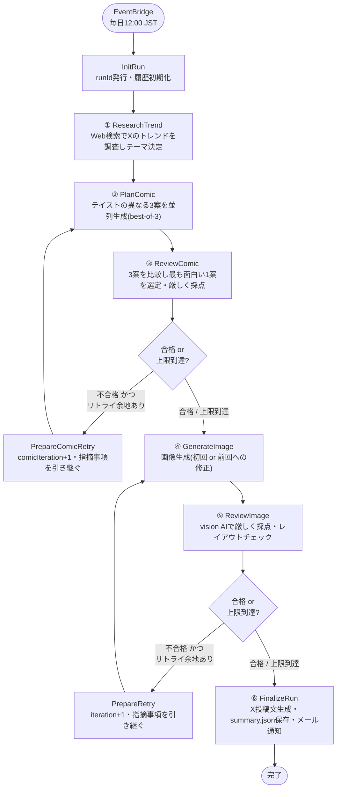

# x-trend-4koma

その日のXのトレンドをテーマにした縦一列4コマ漫画を毎日自動生成し、完成したらメールで通知するサーバーレスパイプライン。AWS CDK（TypeScript）でインフラを管理する。

## 処理フロー

Step Functions（Standard Workflow）が6つのLambdaを実行する。**独立した2つのリトライループ**を持つ:

- テキストのみで「面白いか」を判定するループ（`PlanComic ⇄ ReviewComic`、最大3回 = `MAX_COMIC_ITERATIONS`）。画像生成の前に、オチ・セリフの質が低ければ書き直す。
- 画像ができてから「レイアウト・視認性」を判定するループ（`GenerateImage ⇄ ReviewImage`、最大3回 = `MAX_ITERATIONS`）。



各ステップの入出力はStep Functionsの実行コンテキストにJSONとして蓄積され、`runId` / `llmProvider` / `imageProvider` / `history` / `comicHistory`（各試行の記録）が最初から最後まで引き継がれる。`②③`は「お笑いセンスの学習」節で説明する蓄積フィードバック（`_meta/comedy-learnings.md`）も毎回プロンプトに読み込む。

### LLM・画像生成プロバイダの切り替え

`①②③⑤⑥`（テキスト系タスク）は`llmProvider`、`④`（画像生成）は`imageProvider`で切り替える。実行のたびに指定する必要がある（省略不可）。

| 用途 | 選べる値 | 備考 |
|---|---|---|
| `llmProvider`（調査・構成・レビュー・投稿文生成） | `anthropic` \| `openai` | Claude (Sonnet 5) または OpenAI (gpt-5.1) |
| `imageProvider`（画像生成） | `gemini` \| `openai` \| `bedrock` | Gemini 2.5 Flash Image / OpenAI gpt-image-2 / Bedrock (Stability AI SD3.5 Large, us-west-2) |

日次自動実行は `{"llmProvider": "openai", "imageProvider": "openai"}` 固定（`lib/x-trend-4koma-stack.ts`の`DailySchedule`）。手動実行時は任意の組み合わせを指定できる（後述）。

**実績**: OpenAI/OpenAIの組み合わせが最も安定（一発合格率が高い）。Geminiはレイアウト崩れ・文字化けが頻発、Bedrock(Stability AI)は無害なプロンプトでもコンテンツフィルターに引っかかりやすい。

## AWS構成

| サービス | 役割 |
|---|---|
| **EventBridge (Rule)** | 毎日12:00 JSTにStep Functionsを起動（`enabled`で有効/無効を切替可能） |
| **Step Functions (Standard)** | 6つのLambdaと、面白さ判定・画像修正の2つの独立したリトライループをオーケストレーション |
| **Lambda** (Node.js 22.x, TypeScript / esbuild) | 各処理ステップの実体。6関数すべて`lambda/common/`の共通クライアントを共有 |
| **S3** | 生成画像・プロンプト・レビューJSON・最終`summary.json`を`{runId}/`配下に保存。30日ライフサイクルで自動削除、パブリックアクセスは禁止（署名付きURLのみ） |
| **Secrets Manager** | Anthropic / Gemini / OpenAIの各APIキーを保管（`x-trend-4koma/*-api-key`） |
| **Bedrock** | Stability AI (SD3.5 Large) をIAMロールのみで呼び出し（APIキー不要、`us-west-2`固定、要AWS Marketplaceモデルアクセス同意） |
| **SNS** | 完成通知の配信（`NOTIFY_TOPIC_ARN`で指定する既存トピック。メール購読が確認済みであること） |
| **IAM** | 各Lambdaに必要最小限の権限（対象シークレットのみ読み取り、対象S3バケットのみ読み書き、Bedrock/SNSも対象リソースのみ） |

## ディレクトリ構成

```
bin/app.ts                        — CDKアプリのエントリポイント
lib/x-trend-4koma-stack.ts        — CDKスタック定義(全AWSリソース)

lambda/
├── common/                       — 全Lambda共通のクライアント・ユーティリティ
│   ├── llm-client.ts             — LLMプロバイダ(anthropic/openai)のディスパッチャ
│   ├── anthropic-client.ts       — Anthropic SDKラッパー(テキスト生成・vision・web検索)
│   ├── openai-client.ts          — OpenAI SDKラッパー(テキスト生成・vision・web検索)
│   ├── image-client.ts           — 画像生成プロバイダ(gemini/openai/bedrock)のディスパッチャ
│   ├── gemini-client.ts          — Gemini画像生成(@google/genai)
│   ├── openai-image-client.ts    — OpenAI画像生成(image_generation tool)
│   ├── bedrock-image-client.ts   — Bedrock画像生成(Stability AI, us-west-2)
│   ├── s3.ts / secrets.ts / sns.ts — AWS SDKラッパー
│   ├── json.ts                   — LLM応答からのJSON抽出ヘルパー
│   ├── layout-instructions.ts    — 「縦一列4コマ」固定レイアウト指示文
│   ├── comedy-learnings.ts       — 蓄積フィードバック(_meta/comedy-learnings.md)の読み込み
│   └── types.ts                  — 共通の型定義
├── research-trend/index.ts       — ①トレンド調査
├── plan-comic/index.ts           — ②構成案作成(3テイストを並列生成、best-of-3)
├── review-comic/index.ts         — ③面白さレビュー(3案比較・選定)
├── generate-image/index.ts       — ④画像生成(初回/修正)
├── review-image/index.ts         — ⑤画像レビュー(レイアウト・視認性)
└── finalize-run/index.ts         — ⑥投稿文生成・summary保存・メール通知
```

## セットアップ

```bash
npm install
npx tsc --noEmit   # 型チェック
npx cdk synth       # 構文検証
```

AWS認証（SSO。プロファイル名は各自の`~/.aws/config`で設定したものを使う）:
```bash
aws sso login --profile <your-profile>
export AWS_PROFILE=<your-profile>
```

## デプロイ

`NOTIFY_TOPIC_ARN`（完成通知を送るSNSトピックのARN。メール購読が確認済みの既存トピックを指定）が必須。値はデプロイ環境ごとに異なるためリポジトリには含めず、環境変数で渡す。

```bash
export NOTIFY_TOPIC_ARN="arn:aws:sns:<region>:<account-id>:<topic-name>"
npx cdk deploy
```

初回デプロイ後、Secrets Managerの3シークレットに実際のAPIキーを設定する（プレースホルダー`REPLACE_ME`のまま）。**チャット等にキーを貼らず、必ず自分の端末で実行すること。**

```bash
aws secretsmanager put-secret-value --region ap-northeast-1 \
  --secret-id x-trend-4koma/anthropic-api-key --secret-string '<YOUR_ANTHROPIC_API_KEY>'

aws secretsmanager put-secret-value --region ap-northeast-1 \
  --secret-id x-trend-4koma/gemini-api-key --secret-string '<YOUR_GEMINI_API_KEY>'

aws secretsmanager put-secret-value --region ap-northeast-1 \
  --secret-id x-trend-4koma/openai-api-key --secret-string '<YOUR_OPENAI_API_KEY>'
```

Bedrock (Stability AI) を使う場合は、`us-west-2`リージョンでAWS Marketplaceのモデル利用規約への同意が別途必要（`aws bedrock create-foundation-model-agreement`、従量課金 $0.08/枚）。

## 手動実行

```bash
STATE_MACHINE_ARN=$(aws cloudformation describe-stacks --region ap-northeast-1 \
  --stack-name XTrend4KomaStack \
  --query "Stacks[0].Outputs[?OutputKey=='StateMachineArn'].OutputValue" --output text)

aws stepfunctions start-execution --region ap-northeast-1 \
  --state-machine-arn "$STATE_MACHINE_ARN" \
  --input '{"llmProvider": "openai", "imageProvider": "openai"}'
```

`llmProvider`・`imageProvider`は必須（省略するとステートマシンがエラーになる）。

## 結果の確認

実行完了後、`{runId}/`配下（S3バケット名は`ImageBucketName`スタック出力）に以下が保存される。

```
comic-attempt-1-candidates.json  comic-attempt-1.json  comic-attempt-1-review.json
comic-attempt-2-*                                                              (リトライ時)
comic-attempt-3-*                                                              (リトライ時)
attempt-1-prompt.txt      attempt-1.png      attempt-1-review.json
attempt-2-prompt.txt      attempt-2.png      attempt-2-review.json   (リトライ時)
attempt-3-prompt.txt      attempt-3.png      attempt-3-review.json   (リトライ時)
summary.json              — テーマ・構成・全履歴(history/comicHistory)・X投稿用キャプション(postText)
```

`comic-attempt-N-candidates.json`は3テイスト全案、`comic-attempt-N.json`は選ばれた勝者案、`comic-attempt-N-review.json`は各案のスコアと選定理由。

日次自動実行の有効/無効は`lib/x-trend-4koma-stack.ts`の`DailySchedule`（`events.Rule`の`enabled`）で切り替え、`cdk deploy`で反映する。

## お笑いセンスの学習

`PlanComic`（オチを書く工程）と`ReviewComic`（判定する工程）は、実行のたびにS3上の共有ファイル`_meta/comedy-learnings.md`（`{runId}/`配下とは別の、全実行から共通参照される1ファイル）を読み込み、プロンプトに追加する。ファイルがまだ無い場合は何も注入されず、通常通り動作する。

このファイルへの入力に対応した自動受付フロー（Webフォームやメール返信解析など）は存在しない。生成された漫画を見て感想やダメ出しがあれば、Claude Codeのセッションでそれを伝えると、Claudeが以下のように読み込み・追記・アップロードを行う運用とする:

```bash
IMAGE_BUCKET_NAME=$(aws cloudformation describe-stacks --region ap-northeast-1 \
  --stack-name XTrend4KomaStack \
  --query "Stacks[0].Outputs[?OutputKey=='ImageBucketName'].OutputValue" --output text)

aws s3 cp "s3://${IMAGE_BUCKET_NAME}/_meta/comedy-learnings.md" /tmp/comedy-learnings.md
# 末尾に日付付きで追記してから
aws s3 cp /tmp/comedy-learnings.md "s3://${IMAGE_BUCKET_NAME}/_meta/comedy-learnings.md"
```
